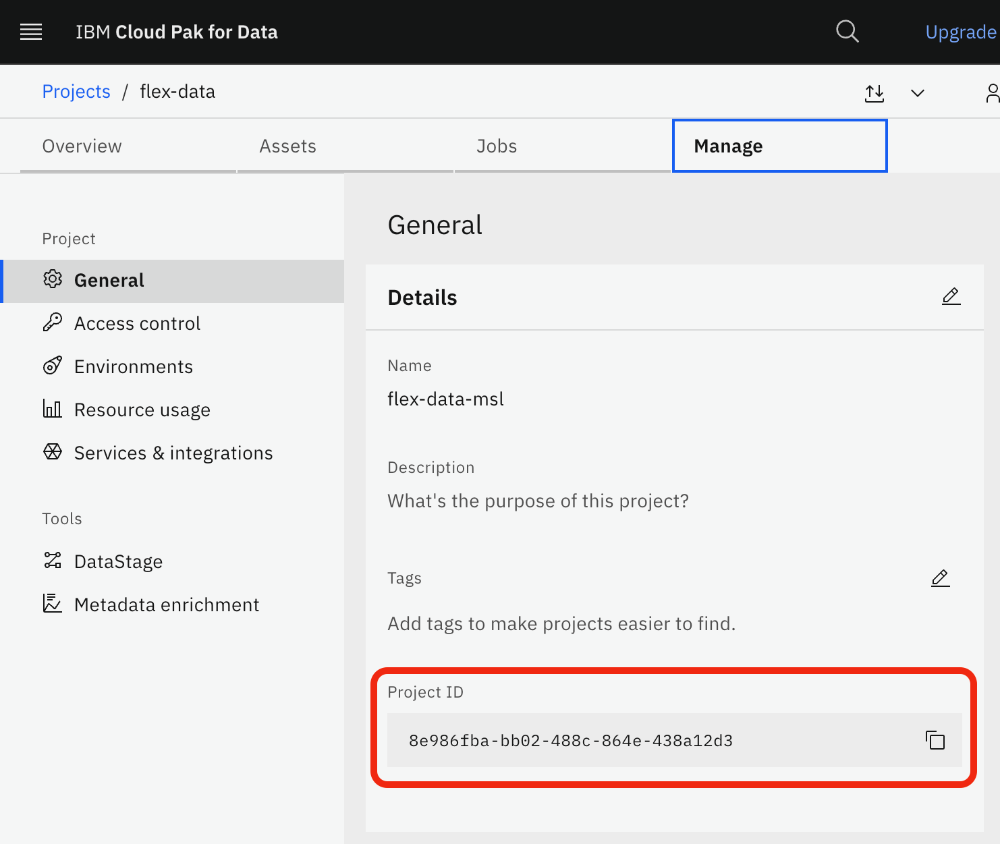
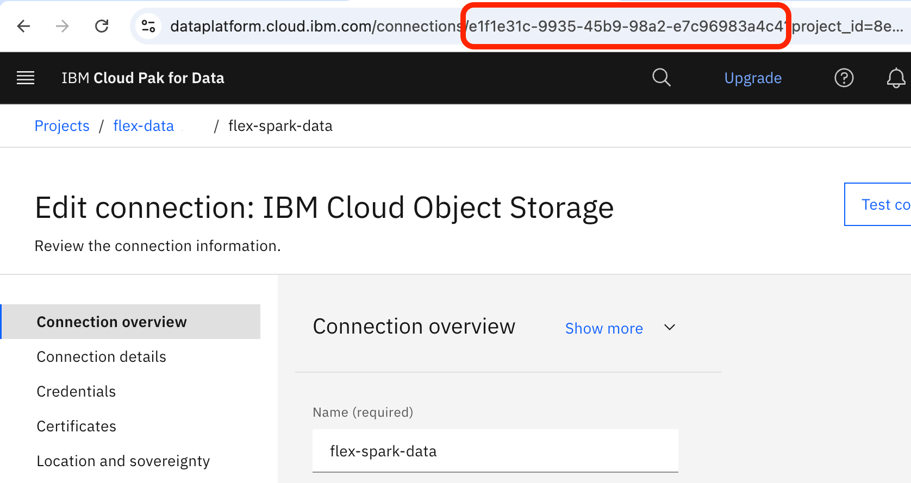
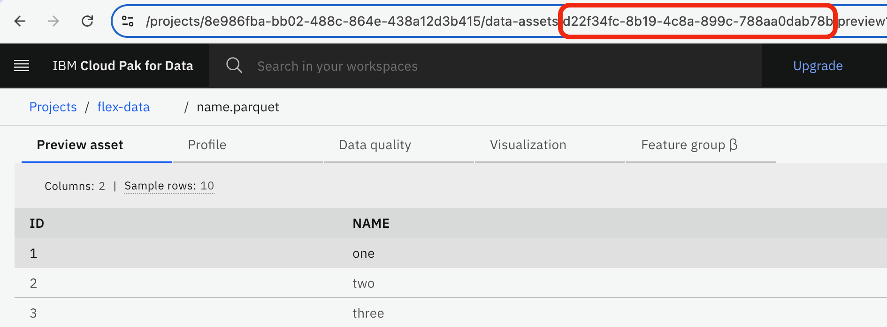
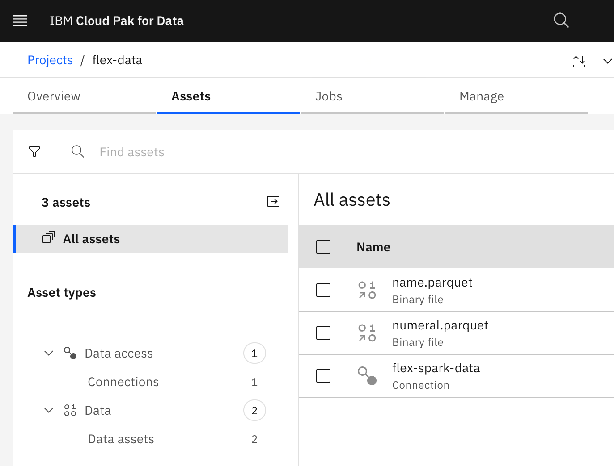
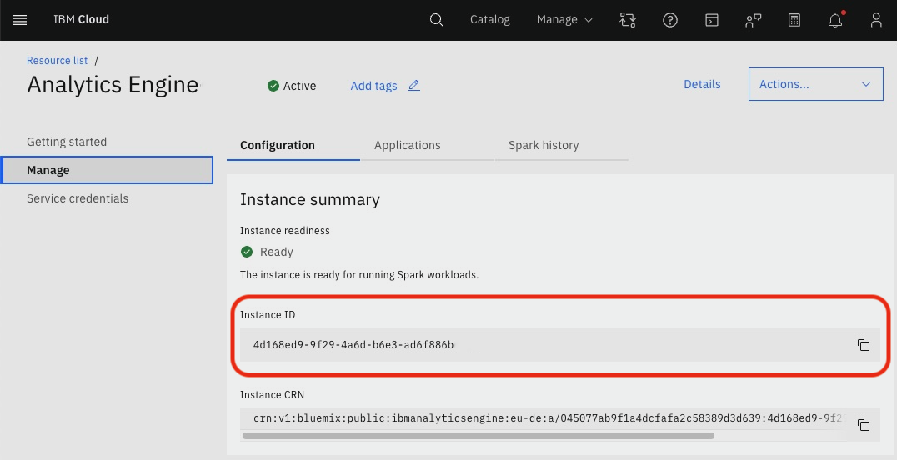

# Using Arrow Flight with Spark Java applications in IBM Cloud

This tutorial demonstrates how the Arrow Flight service provided by IBM Cloud Pak for Data can be used to read and write datasets from within a Spark Java application deployed in IBM Analytics Engine. Arrow Flight provides a common interface for Spark applications to interact with a variety of different data sources.

## What is Arrow Flight?

Arrow Flight is an RPC framework for high performance transfer of data. It uses Apache Arrow as the "on-the-wire" data representation, and gRPC as the binary data transport. Arrow Flight can stream batches of data in parallel, allowing simultaneous read and write of data sources. Using Arrow Flight for data transfer avoids the need for the Spark application to interact with data source-specific drivers or to deal with different data formats.

Arrow Flight also provides a set of metadata methods, allowing the discovery of available data resources. Using Arrow Flight for metadata discovery avoids tight coupling between the Spark application and dataset on which it interacts, since the location of the data and credentials required for access are held outside of the application.

## Flight service in IBM Cloud Pak for Data

The Flight service provided by IBM Cloud Pak for Data is used to:

1. Discover defined data assets, and the credentials required to access those assets.
2. Read and write to data assets using Arrow Flight.


A single access credential is required to discover data assets using the Flight service. This is typically an OAuth token for the session, obtained using an API key. The discovery results include all the information needed to access a data asset using the Flight service.

Two types of asset can be used to reference data with the Flight service:

1. Use a **Data Asset** that refers directly to the data; or
2. Use a **Connection** in that describes how to connect to a specific data source, and a path within that data source.

[Assets][assets] are configured within a specific [Project][project] defined in Cloud Pak for Data.

For Spark applications, use of the Flight service allows data to be read from and written to a variety of different data sources using a common interface. The application requires no knowledge of the actual data location, the data format, the type of data source, or the data access credentials.

## Sample application overview

The sample Spark application runs in IBM Analytics Engine and demonstrates the use of Flight to read and write datasets stored in IBM Cloud Object Storage (COS).

The sample application implements the following simple logic:

1. Read two input datasets (`name.parquet` and `numeral.parquet`, stored in COS).
2. Join on the datasets to produce a result dataset.
3. Write the result output (to a specific location within a COS bucket).

The reads and write are performed using the Flight service provided by Cloud Pak for Data. The two input datasets are configured in Cloud Pak for Data as Data Assets, and are referenced by their unique ID and the ID of their containing project. For the output dataset, a Connection is configured in IBM Cloud Pak for Data, which is referenced by its unique ID and the ID of the containing project. When writing the output dataset, a path specifies where the output should be written within the data source described by the Connection.

### Using the Flight service

For each read or write of a given asset, the following interactions with the Flight service take place:

1. Discovery of the Data Asset or Connection.
2. Read or write of the data using the discovered information.

Discovery is performed by invoking the Flight service REST API. The application uses an OAuth token to authenticate with the Flight service. This token obtained from the Identity and Access Management (IAM) authentication service using an API key, and used throughout the execution of the application.

For a long-running applications, it is possible for the OAuth token to expire during the lifetime of the application. IBM Cloud SDKs provide abstractions of the authentication process that transparently re-authenticate in the event of token expiry. For the sake of clarity, this sample ignores that complexity and uses the IBM Cloud REST APIs directly. A production application should make use of the available IBM Cloud SDKs.

Read or write of Spark datasets are performed using the normal Spark API, exactly as for any other data source. In common with Spark read/write operations to specific data sources, the application supplies both a format string and options specific to that format to configure Spark to use the Flight service to access data. The format string for the Flight service is `com.ibm.connect.spark.flight`, and the options are derived from the asset information discovered using the Flight service. The application requires no knowledge of the mechanics of data access using Flight.

The runtime libraries required for data access using Flight are already deployed and available in IBM Analytics Engine. Since the application only uses Spark APIs for data access, there is no compile-time dependency on Flight libraries.

### Detailed application flow

In order to perform the simple join of two datasets using the Flight service for data access, the application performs the following sequence of operations:

1. Obtain an OAuth token from the IAM authentication service using an API key.

2. Read the **names** dataset from `name.parquet`:

   1. Discover the `name.parquet` Data Asset from the Flight service by asset and project ID.
   2. Build Spark read options from the discovery results.
   3. Use Spark APIs to read the **names** dataset.

3. Read the **numerals** dataset from `numeral.parquet`:

   1. Discover the `numeral.parquet` Data Asset from the Flight service by asset and project ID.
   2. Build Spark read options from the discovery results.
   3. Use Spark APIs to read the **numerals** dataset.

4. Join the **names** and **numerals** datasets using a join column name.

5. Write the resulting dataset to a specified location:

   1. Discover a location within a data source Connection from the Flight service by connection and project ID.
   2. Build Spark write options from the discovery results.
   3. Use Spark APIs to write the resulting dataset.

### Application structure

The Java application source code is found in the `src/main/java` folder, and consists of these packages:

- `com/ibm/sample/cloud` — Utilities for interacting with IBM Cloud services, including authentication.
- `com/ibm/sample/spark` — Sample Spark application.
- `com/ibm/sample/spark/flight` — Classes used to perform discovery using the Flight service.

Javadoc describes each class and their methods.

The Spark application implementation is found in the `com.ibm.sample.spark.App` class. Execution begins in the `main()` method, where an OAuth token is created and passed to the `App()` constructor. Finally, `run()` is called on the App instance to execute the Spark application logic.

## Pre-requisites

The following services must be created and running in IBM Cloud:

- [Cloud Object Storage](https://cloud.ibm.com/docs/cloud-object-storage?topic=cloud-object-storage-getting-started-cloud-object-storage) bucket to store the Spark application and data files.
- [Cloud Pak for Data on IBM Cloud](https://www.ibm.com/docs/en/cloud-paks/cp-data) where data assets will be defined.
- [IBM Analytics Engine](https://cloud.ibm.com/docs/AnalyticsEngine/) serverless instance, using Spark 3.4.

The following are also required:

- An [IBM Cloud API key](https://cloud.ibm.com/docs/account?topic=account-userapikey).
- The [jq](https://jqlang.github.io/jq/) command available in your PATH.
- Java 11 (or later).

## Steps

1. Configure IBM Cloud resources
2. Deploy the Spark sample application
3. Run the Spark sample application

### Step 1. Configure IBM Cloud resources

Several resources must be configured in IBM Cloud for use by the Spark sample application.

#### Cloud Object Storage

Upload the following input data files to a location of your choice in the Cloud Object Storage bucket:

- `resources/name.parquet`
- `resources/numeral.parquet`

#### Cloud Pak for Data

1. Create a [project] to act as a container for connections and data assets. Note the ID of the project you create, which can be found on the **Manage** tab of the project page in the [Cloud Pak for Data console][cloud-pak].

   

2. Add a [connection](https://dataplatform.cloud.ibm.com/docs/content/wsj/manage-data/create-conn.html) to your COS bucket as a data source. Note the connection ID, which appears as a hexadecimal UUID in the connection's page URL.

   

3. Import the name and numeral datasets as [connected data assets](https://dataplatform.cloud.ibm.com/docs/content/wsj/manage-data/connected-data.html). Note the data asset ID, which appears as a hexadecimal UUID in the data asset's page URL.

   

You should now have three assets (one connection and two data assets) in the **Assets** tab of your project page in the [Cloud Pak for Data console][cloud-pak].



#### Analytics Engine

Note the ID for your Analytics Engine instance, which can be found on its **Manage** page in the [IBM Cloud console][ibm-cloud]. The instance ID will be a hexadecimal UUID. The instance ID is required when submitting jobs to the Spark service.



### Step 2. Deploy the Spark sample application

Before we can run the Spark sample application described above, we must configure it with the IDs of the resources deployed in IBM Cloud. The compiled application code then needs to be placed in Cloud Object Storage, where it can be accessed by the Analytics Engine instance.

1. Update the `src/main/resources/config.properties` file used by the sample application at runtime, setting appropriate values for the following properties:

   - `project` — The ID of the Cloud Pak for Data project.
   - `name_asset` — The ID of Data Asset referring to `name.parquet` in Cloud Object Storage.
   - `numeral_asset` — The ID of the Data Asset referring to `numeral.parquet` in Cloud Object Storage.
   - `connection` — The ID of the Connection referring to the Cloud Object Storage bucket where the results will be written.
   - `result_path` — The location within Cloud Object Storage where the results should be written. Note that this must start with the COS bucket name, and must match the name of the COS bucket referred to by the Connection. For example: `my-cos-bucket/path/to/result.parquet`

2. Run the Gradle build to generate an application JAR file for the Spark sample application:

   ```
   ./gradlew build
   ```

3. Upload the packaged Spark application JAR to a suitable location in Cloud Object Storage. For example, using the AWS CLI command:

   ```shell
   aws s3 cp build/libs/spark-flight-sample.jar s3://my-cos-bucket/path/to/spark-flight-sample.jar
   ```

   > **Note:** If you are using the AWS CLI command to access data in IBM Cloud Object Storage, you will need explicitly configure the appropriate [Cloud Object Storage endpoint URL][cos-endpoints] for your bucket's location, by either:
   >
   > 1. Setting the `AWS_ENDPOINT_URL` environment variable; or
   > 2. Defining the endpoint URL in an AWS CLI configuration file.

### Step 3. Run the Spark sample application

The deployed application is run by submitting a job to our Analytics Engine instance.

1. In your local shell, define these required environment variables:

   ```shell
   export AUTH_KEY='<IBM Cloud API key>'
   export AWS_ACCESS_KEY_ID='<COS access key ID>'
   export AWS_SECRET_ACCESS_KEY='<COS secret access key>'
   ```

   The COS credentials are passed to IBM Analytics Engine in order to access the Spark sample application published in Cloud Object Storage. The IBM Cloud API key is passed to the Spark application and used to obtain an access token from the Identity and Access Management (IAM) authentication service, which is used to access the Flight service.

   To use a [Cloud Object Storage endpoint URL][cos-endpoints] other than the default `https://s3.direct.us-south.cloud-object-storage.appdomain.cloud`, set the following environment variable:

   ```shell
   export AWS_ENDPOINT_URL='<COS endpoint URL>'
   ```

2. Submit a job to IBM Analytics Engine, supplying the ID of the Analytics Engine instance on which it should be run, and the COS bucket name and path within that bucket of the Spark application JAR uploaded in the **Deploy** step above, for example `my-cos-bucket/path/to/spark-flight-sample.jar`:

   ```shell
   ./scripts/spark-submit.sh '<Analytics Engine instance ID>' '<Spark application path>'
   ```

   The `spark-submit.sh` script carries out the following operations:

   1. Obtain an OAuth token using the IBM Cloud API key in the `AUTH_KEY` environment variable.
   2. Generate a Spark job submission message using the `spark-submit.json` template.
   3. Submit the Spark job to IBM Analytics Engine using the OAuth token.
   4. Poll the status of the submitted job until completion.

   The application location URL provided in the job submission will be of the form `cos://bucket-name.data/jar-path`. For example, a supplied Spark application path of `my-cos-bucket/path/to/spark-flight-sample.jar` will be translated by the script to `cos://my-cos-bucket.data/path/to/spark-flight-sample.jar` in the job submission message.

3. Inspect the result dataset, which is written to the location in Cloud Object Storage specified by the `result_path` configuration property, using the Flight service and the Connection asset. You can download the result data from Cloud Object Storage. For example, using the AWS CLI command:

   ```shell
   aws s3 cp s3://my-cos-bucket/path/to/result.parquet .
   ```

## Summary

This tutorial described the capabilities and benefits provided by the Arrow Flight service when used by a Spark application running in IBM Cloud. We demonstrated the use of the Arrow Flight service to read and write data sets by deploying and running a sample Spark Java application.

For further details of the Flight service provided by IBM Cloud Pak for Data, and how it can be used from Python or R applications, see the [Cloud Pak for Data documentation](https://www.ibm.com/docs/en/cloud-paks/cp-data/5.0.x?topic=project-accessing-data-sources-flight-service). Of particular interest may be the description of [supported Flight properties and their values](https://www.ibm.com/docs/en/cloud-paks/cp-data/5.0.x?topic=applications-flight-data-requests), which are applicable to all client programming languages. When [working with large volumes of data](https://www.ibm.com/docs/en/cloud-paks/cp-data/5.0.x?topic=adsfs-best-practices-loading-large-volumes-data-from-file-connection), the best practices described in the Cloud Pak for Data documentation may be helpful.

The Flight service provided by Cloud Pak for Data can be accessed by applications running outside of the Cloud Pak for Data instance. See the documentation for information on how to [configure routes to enable this access](https://www.ibm.com/docs/en/cloud-paks/cp-data/5.0.x?topic=connections-configuring-external-route-flight-service).

Finally, for a technical deep-dive into the Arrow Flight protocol and Arrow data format, see the [Apache Arrow documentation](https://arrow.apache.org/docs/format/Flight.html).

[assets]: https://dataplatform.cloud.ibm.com/docs/content/wsj/manage-data/manage-assets.html
[project]: https://dataplatform.cloud.ibm.com/docs/content/wsj/manage-data/manage-projects.html
[connection-cos]: https://dataplatform.cloud.ibm.com/docs/content/wsj/manage-data/conn-cos.html
[cos-endpoints]: https://cloud.ibm.com/docs/cloud-object-storage?topic=cloud-object-storage-endpoints
[ibm-cloud]: https://cloud.ibm.com/
[cloud-pak]: https://dataplatform.cloud.ibm.com/
